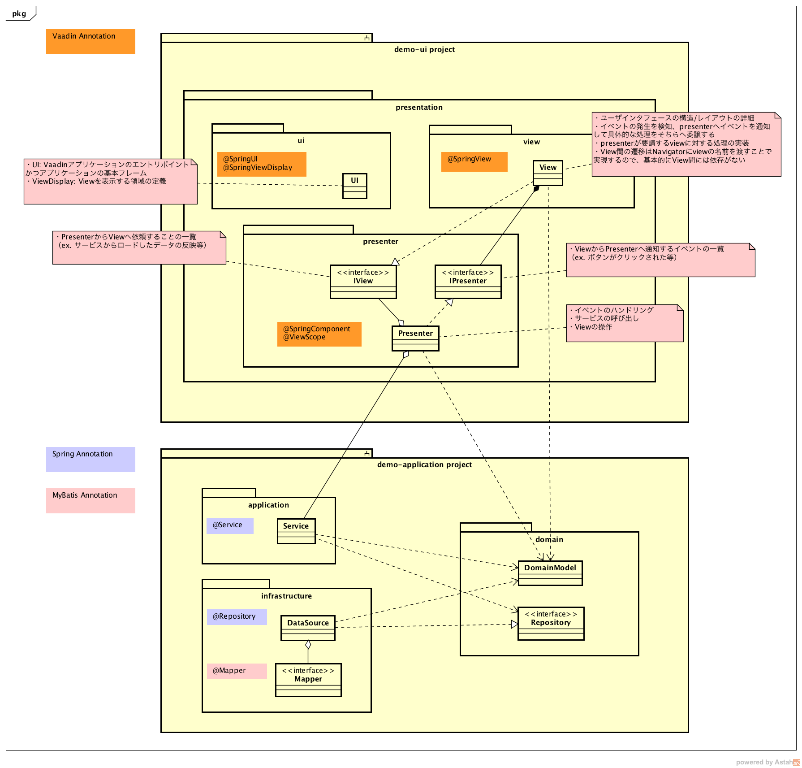
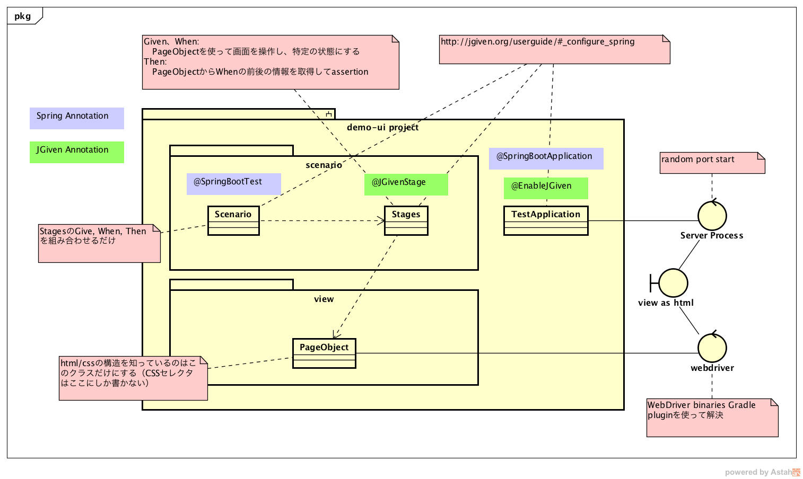

# vaadin-ddd-demo

Demo application with DDD and MVP by Spring Boot and Vaadin Framework8.

## Description

### core design concept

Domain Driven Design + MVP architecture.



### frameworks

* Web Application framework: Spring Boot https://projects.spring.io/spring-boot/ 
* UI framework: Vaadin Framework https://vaadin.com/framework
* SQL mapper: MyBatis http://blog.mybatis.org/

### supported database

* PostgreSQL https://www.postgresql.org/

### other libraries and tools

* Build tool: Gradle https://gradle.org/
* IDE: IntelliJ IDEA https://www.jetbrains.com/idea/
* Libraries:
  * Lombok https://projectlombok.org/
    * do away with boilerplate code from domain model
    * using for 2 purposes:
      * define ValueObject's getter/setter and no args constructor which Vaadin's com.vaadin.data.Binder#bind() require
      * define Aggregation's no args constructor which MyBatis's ResultMap require
    * so our implementations don't depend on methods created by Lombok. these methods are only used by Framework.

### testing design

#### ui(end to end)



##### used libraries & tools:
* Selenide http://selenide.org/
  * test automation powered by Selenium WebDriver
* JGiven http://jgiven.org/
  * Behavior-Driven Development in Plain Java
* WebDriver binaries Gradle plugin https://github.com/energizedwork/webdriver-binaries-gradle-plugin/blob/master/README.md

#### backend

under construction...

## Usage

### setup database

* install PostgreSql.
* create user + database, and grant all to the user. 

```
postgres=# CREATE USER vaadin_demo_app_user WITH PASSWORD 'abcdefg';
CREATE ROLE
postgres=# CREATE DATABASE vaadin_demo_app;
CREATE DATABASE
postgres=# GRANT ALL ON DATABASE vaadin_demo_app TO vaadin_demo_app_user;
GRANT
```

### start application

`./bootRun.sh`

access http://localhost:8080/
